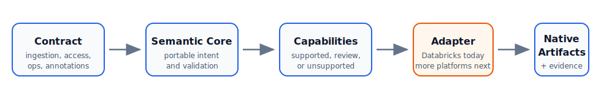

<p align="center">
  
</p>

# ContractForge

**Define ingestion intent once. Run it natively anywhere.**

<p align="center">
  <a href="https://github.com/marquesantero/contractforge/actions/workflows/ci.yml"></a>
  <a href="https://github.com/marquesantero/contractforge/actions/workflows/release.yml"></a>
  <a href="https://github.com/marquesantero/contractforge"></a>
  <a href="https://marquesantero.github.io/contractforge/"></a>
  <a href="https://github.com/marquesantero/contractforge/tree/main/src/contractforge_core"></a>
  <a href="https://github.com/marquesantero/contractforge/tree/main/ai"></a>
  
  <a href="LICENSE"></a>
</p>

<p align="center">
  <a href="https://marquesantero.github.io/contractforge/">Documentation</a>
  ·
  <a href="docs/quickstart.md">Quick Start</a>
  ·
  <a href="docs/adapters.md">Adapters</a>
  ·
  <a href="ai/README.md">ContractForge AI</a>
  ·
  <a href="docs/roadmap.md">Roadmap</a>
</p>

**Covered platforms:** Databricks, AWS Glue/Iceberg, Snowflake, Microsoft Fabric
Lakehouse and Google Cloud BigQuery. The adapters are separate packages, but
they execute the same contract vocabulary through native platform behavior.

ContractForge is a multi-runtime, contract-first ingestion platform. It turns
governed ingestion intent into native platform execution and evidence while
keeping the contract vocabulary stable across Databricks, AWS, Snowflake,
Fabric and GCP.

`contractforge-core`, `contractforge-databricks`, `contractforge-aws`,
`contractforge-fabric`, `contractforge-snowflake`, `contractforge-gcp` and
`contractforge-ai` are functional package boundaries that keep platform
dependencies isolated while preserving the same contract language.

It is built for data consultants, platform teams and engineering groups that
need repeatable governed ingestion across different client runtimes without
rewriting the framework for every platform.

<p align="center">
  
</p>

## Why ContractForge

| Capability | What it means |
| --- | --- |
| Contract-first ingestion | Source, target, write mode, schema policy, transforms, quality, access, operations and evidence live in reviewed YAML contracts. |
| Honest portability | The planner returns `SUPPORTED`, `SUPPORTED_WITH_WARNINGS`, `REVIEW_REQUIRED` or `UNSUPPORTED`; it does not silently downgrade semantics. |
| Native adapters | Databricks, AWS, Snowflake, Fabric and GCP translate the same intent into native runtime behavior instead of forcing a lowest-common-denominator engine. |
| Evidence as product surface | Deployments, runs, errors, quality, quarantine, schema changes, lineage, governance actions and cost signals are tracked consistently. |
| Reusable connections | Shared `connection.yaml` files centralize connector defaults; ingestion contracts override only dataset-specific fields. |
| AI-assisted project design | ContractForge AI turns prompts and schemas into reviewable projects, then validates them through Core and adapter planners. |

## How It Works

```text
Contract YAML
  -> Semantic Core
  -> Capability Matcher
  -> Abstract Execution Plan
  -> Platform Adapter
  -> Native Runtime + Evidence
```

The core owns portable semantics. Adapters own platform behavior.
The core does not import Spark, Databricks SDK, boto3, Azure SDK, Fabric SDK or Snowflake clients.

## See It In 30 Seconds

```yaml
source:
  type: incremental_files
  path: s3://landing/orders
  format: json

target:
  catalog: main
  schema: bronze
  table: orders

mode: append
schema_policy: additive_only
quality_rules:
  not_null: [order_id]
```

Core planning result:

```text
SUPPORTED
```

The Databricks adapter may render Delta/Auto Loader/Asset Bundle artifacts. The
AWS adapter may render and deploy Glue Spark/Iceberg artifacts. Another adapter
may return `SUPPORTED_WITH_WARNINGS`, `REVIEW_REQUIRED` or `UNSUPPORTED` if it
cannot preserve the same semantics safely.

## Status And Roadmap

| Area | Status | Notes |
| --- | --- | --- |
| Core semantic model | Active | Contract models, semantic normalization, capability matching, abstract planning and evidence models are implemented. |
| Databricks adapter | Reference implementation | Delta, Unity Catalog, Auto Loader, Lakeflow planning, Asset Bundles, control tables, quality, governance, lineage, cost and dashboards are implemented inside the adapter boundary. |
| AWS adapter | Stable supported surface | Glue Spark/Iceberg planning, source support, quality/evidence, Lake Formation review/apply helpers, annotations, operations, S3 artifact publication, one-command Glue deployment, orchestration, cost reconciliation and Glue job helper APIs are validated for the documented `aws_glue_iceberg` surface. |
| ContractForge AI | Active | Deterministic review, project generation, diagnostics, provider routing and optional model-backed enrichment over the same core contract semantics. |
| Snowflake adapter | Stable supported surface | SQL warehouse runtime, hosted Snowpark procedure library runner, table/SQL/bounded REST/staged-file sources, write modes, quality, schema policy, governance, evidence, lineage and cost reconciliation are validated for the documented `snowflake_sql_warehouse` surface. |
| Fabric adapter | Stable supported surface | Notebook-first Lakehouse execution, broad source expansion, core write modes, evidence, governance review/apply helpers and deployment promotion are validated for the documented `fabric_lakehouse` surface. |
| GCP adapter | Stable supported surface | BigQuery table/view/SQL sources, GCS load jobs, registered BigLake Iceberg reads, append/overwrite/explicit-column upsert, SQL quality, evidence, row policies, direct masking, policy tags and descriptions are validated for the documented `gcp_bigquery` surface. |

See [roadmap](docs/roadmap.md) for adapter maturity and release criteria.

## Install

From GitHub:

```bash
pip install "git+https://github.com/marquesantero/contractforge.git"
pip install "git+https://github.com/marquesantero/contractforge.git#subdirectory=adapters/databricks"
pip install "git+https://github.com/marquesantero/contractforge.git#subdirectory=adapters/aws"
pip install "git+https://github.com/marquesantero/contractforge.git#subdirectory=adapters/fabric"
pip install "git+https://github.com/marquesantero/contractforge.git#subdirectory=adapters/snowflake"
pip install "git+https://github.com/marquesantero/contractforge.git#subdirectory=adapters/gcp"
pip install "git+https://github.com/marquesantero/contractforge.git#subdirectory=ai"
```

Local development:

```bash
uv sync --all-extras
uv run pytest
```

Build wheels independently:

```bash
uv build --wheel
cd adapters/databricks && uv build --wheel
cd ../aws && uv build --wheel
cd ../snowflake && uv build --wheel
cd ../fabric && uv build --wheel
cd ../gcp && uv build --wheel
cd ../../ai && uv build --wheel
```

Release package names:

```bash
pip install contractforge-core contractforge-databricks contractforge-aws contractforge-snowflake contractforge-fabric contractforge-gcp contractforge-ai
```

Runtime delivery is platform-specific even though every adapter is published as
a PyPI package and wheel:

| Runtime | Preferred package delivery | Fallback |
| --- | --- | --- |
| Databricks | Install `contractforge-core` and `contractforge-databricks` from PyPI in the job, cluster or notebook environment. | Attach uploaded wheels when the workspace cannot reach PyPI or must use CI-pinned artifacts. |
| AWS Glue / Iceberg | Install locally/CI from PyPI, then pass S3-hosted core and AWS adapter wheels to Glue jobs. | Use public PyPI from Glue only when outbound package access is intentionally allowed. |
| Snowflake | Install locally/CI from PyPI for deployment tooling; SQL/task graph artifacts run natively. | Hosted Snowpark procedures use staged ZIP imports built from the core and adapter libraries. |
| Fabric | Install `contractforge-core` and `contractforge-fabric` from PyPI in the notebook/runtime environment. | Attach or install built wheels when PyPI is unavailable. |
| GCP BigQuery / BigLake | Install `contractforge-core` and `contractforge-gcp` where CLI/CI deployment helpers run. | BigQuery and Workflows execute native artifacts; use wheels for private runners or pinned builds. |

## Contract Deployment Versioning

ContractForge records deployment versions in a shared control table named
`ctrl_deployment_versions`. The core owns the table schema and deterministic
hash rules; each adapter owns where the table is created and how rows are
written on the target platform.

Every deploy command creates a unique `deployment_id`. Each deployed contract
step or native artifact records stable hashes for the deployed contract,
resolved environment, adapter manifest and deployment row. This makes repeated
deploys auditable across Databricks, AWS, Snowflake, Fabric and GCP without
relying on file names or platform timestamps.

## Packages And Releases

ContractForge is published as independent PyPI packages from one repository.
The package boundary is intentional: the core stays platform-neutral, while
adapters carry native runtime dependencies and behavior.

| Package | Current version | PyPI | Source |
| --- | --- | --- | --- |
| `contractforge-core` | `0.2.0` | [PyPI](https://pypi.org/project/contractforge-core/) | [core](src/contractforge_core) |
| `contractforge-databricks` | `0.2.0` | [PyPI](https://pypi.org/project/contractforge-databricks/) | [adapter](adapters/databricks) |
| `contractforge-aws` | `0.2.0` | [PyPI](https://pypi.org/project/contractforge-aws/) | [adapter](adapters/aws) |
| `contractforge-snowflake` | `0.2.0` | [PyPI](https://pypi.org/project/contractforge-snowflake/) | [adapter](adapters/snowflake) |
| `contractforge-fabric` | `0.2.0` | [PyPI](https://pypi.org/project/contractforge-fabric/) | [adapter](adapters/fabric) |
| `contractforge-gcp` | `0.2.0` | [PyPI](https://pypi.org/project/contractforge-gcp/) | [adapter](adapters/gcp) |
| `contractforge-ai` | `0.3.0` | [PyPI](https://pypi.org/project/contractforge-ai/) | [AI companion](ai) |

Releases are built by [`.github/workflows/release.yml`](.github/workflows/release.yml).
The workflow publishes with PyPI Trusted Publishing through the GitHub
environment named `pypi`; API-token publishing is intentionally not part of the
repository workflow. The workflow can be started manually with
`workflow_dispatch` for one package, or by pushing package-specific tags:

```text
v<version>-core
v<version>-databricks
v<version>-aws
v<version>-snowflake
v<version>-fabric
v<version>-gcp
v<version>-ai
```

The workflow publishes the selected package to PyPI/TestPyPI through trusted
publishing and keeps GitHub Release assets for environments that cannot resolve
PyPI at runtime:

- `.whl`: standard Python wheel for Databricks, Fabric, private runners and
  S3-hosted AWS Glue dependencies;
- `.tar.gz`: source distribution for reproducible rebuilds;
- `.zip`: ZIP alias of the wheel for runtimes such as Snowflake Python
  procedures that accept staged ZIP imports but reject `.whl` imports.

PyPI does not allow overwriting an existing version. Before publishing from this
repository, bump the target package version and publish a new tag or manual
release workflow run.

## Project Shape

A complete ContractForge project keeps runtime concerns separate from contract
semantics:

```text
project.yaml
environments/
  databricks.environment.yaml
  aws.environment.yaml
connections/
  supabase.yaml
contracts/
  bronze/
    b_products/
      b_products.ingestion.yaml
      b_products.annotations.yaml
      b_products.operations.yaml
      b_products.access.yaml
```

Example shared connection:

```yaml
source:
  type: connector
  connector: postgres
  system: supabase
  options:
    url: "{{ secret:supabase/jdbc_url }}"
auth:
  type: basic
  username: "{{ secret:supabase/user }}"
  password: "{{ secret:supabase/password }}"
read:
  fetchsize: 20000
```

Example ingestion override:

```yaml
source:
  type: connection
  connection_path: project://connections/supabase.yaml
  table: public.products
  read:
    partition_column: product_id
    num_partitions: 8
```

The core resolves the connection before adapters plan or execute. Ingestion
values override global connection defaults.

## Platform Adapters

| Adapter | Package | Status | Native responsibilities |
| --- | --- | --- | --- |
| Databricks | `contractforge-databricks` | Reference implementation | Delta, Unity Catalog, Auto Loader, Lakeflow planning, Jobs, Asset Bundles, control tables, governance, lineage, cost and dashboards. |
| AWS | `contractforge-aws` | Stable supported surface | Glue Spark, Iceberg, Glue Catalog, Lake Formation review/apply helpers, S3 artifacts, Glue jobs, Athena/Iceberg evidence and cost records for the documented `aws_glue_iceberg` surface. |
| Fabric | `contractforge-fabric` | Stable supported surface | Notebook-first Lakehouse execution, Lakehouse Delta writes, source expansion, shortcut reads, Kafka catch-up, core write modes, control evidence, workspace roles, sensitivity labels and OneLake data access role apply helpers for the documented `fabric_lakehouse` surface. |
| Snowflake | `contractforge-snowflake` | Stable supported surface | SQL warehouse runtime, hosted Snowpark procedure library runner with staged ZIP imports, table/SQL/bounded REST/staged-file sources, append/overwrite/upsert/hash-diff writes, quality, schema policy, governance, evidence/control tables, lineage, cost reconciliation and project deployment for the documented `snowflake_sql_warehouse` surface. Task graph live execution still needs task grants. See [Snowflake adapter guide](docs/adapters/snowflake.md). |
| GCP | `contractforge-gcp` | Stable supported surface | BigQuery table/view/SQL sources, GCS load jobs, BigLake Iceberg table reads, core writes, SQL quality, evidence tables, row access policies, masking, policy tags and descriptions for the documented `gcp_bigquery` surface. |

Use the same project model for adapter deployment:

```bash
contractforge-databricks deploy-project examples/real-world/supabase-jdbc-medallion/project.yaml --target dev
contractforge-aws deploy-project examples/real-world/supabase-jdbc-medallion/project.yaml --dry-run --summary-only
```

## ContractForge AI

ContractForge AI is the planning and review companion. It can generate project
scaffolds from prompts and schemas, validate project folders, compare adapter
planning and produce clear HTML approval reports.

```bash
contractforge-ai guided-project \
  --intent "Create a Supabase medallion project for Databricks, AWS, Snowflake, Fabric and GCP daily at 6 Sao Paulo time." \
  --schema schemas/products.json \
  --target contractforge-yaml \
  --allow-review-required \
  --output-dir generated/supabase

contractforge-ai validate-project-structure generated/supabase \
  --adapter databricks \
  --adapter aws \
  --adapter snowflake \
  --adapter fabric \
  --adapter gcp \
  --format html > generated/supabase/project_validation.html
```

Model providers are optional. Deterministic validation and adapter planners
remain the source of truth; providers can explain or enrich, but they cannot
invent support status.

## Core Planning Example

```python
from contractforge_core.capabilities import PlatformCapabilities
from contractforge_core.contracts import semantic_contract_from_mapping, validate_contract
from contractforge_core.planner import plan_contract

contract = validate_contract(
    {
        "source": {"type": "incremental_files", "path": "s3://landing/orders", "format": "json"},
        "target": {"catalog": "main", "schema": "bronze", "table": "orders"},
        "mode": "append",
        "schema_policy": "additive_only",
        "quality_rules": {"not_null": ["order_id"]},
    }
)

semantic = semantic_contract_from_mapping(contract)
capabilities = PlatformCapabilities(
    platform="example",
    supports_append=True,
    supports_overwrite=True,
    supports_merge=False,
    evidence_stores=("audit_tables",),
)

result = plan_contract(semantic, capabilities)
print(result.status)
```

## Package Boundaries

| Layer | Package | Responsibility |
| --- | --- | --- |
| Semantic core | `contractforge-core` | Contract models, validation, semantic normalization, capability matching, abstract plans, portability diagnostics and neutral evidence models. |
| Databricks adapter | `contractforge-databricks` | Databricks capabilities, rendering, runtime execution, governance, evidence filling and deployment helpers. |
| AWS adapter | `contractforge-aws` | AWS capabilities, Glue/Iceberg planning, runtime helpers, S3 publication, deployment helpers and evidence filling. |
| Fabric adapter | `contractforge-fabric` | Fabric Lakehouse capabilities, Notebook rendering/execution, source expansion, governance apply helpers and deployment promotion. |
| Snowflake adapter | `contractforge-snowflake` | Snowflake SQL warehouse capabilities, hosted procedure runtime, task graph execution, governance, lineage, cost and evidence filling. |
| GCP adapter | `contractforge-gcp` | BigQuery capabilities, GCS load-job rendering, smoke execution, evidence DDL, governance smokes and BigLake Iceberg table support. |
| AI companion | `contractforge-ai` | Deterministic review, project generation, diagnostics, provider routing, report generation and optional model-backed enrichment. |

Publication stays split: each package builds its own wheel and all adapters
depend explicitly on `contractforge-core`.

The core wheel owns only `contractforge_core`; adapter wheels such as `contractforge-databricks` own their adapter package and depend explicitly on the core.

See [publication packaging](docs/specs/publication-packaging.md).

## Documentation

| Topic | Link |
| --- | --- |
| Online site | [marquesantero.github.io/contractforge](https://marquesantero.github.io/contractforge/) |
| Documentation index | [docs/README.md](docs/README.md) |
| Quick start | [docs/quickstart.md](docs/quickstart.md) |
| Architecture | [docs/architecture.md](docs/architecture.md) |
| Contracts | [docs/contracts.md](docs/contracts.md) |
| Project YAML | [docs/project-yaml.md](docs/project-yaml.md) |
| Connection YAML | [docs/connection-yaml.md](docs/connection-yaml.md) |
| Adapters | [docs/adapters.md](docs/adapters.md) |
| Databricks adapter | [docs/databricks.md](docs/databricks.md) |
| AWS adapter | [docs/adapters/aws.md](docs/adapters/aws.md) |
| Snowflake adapter | [docs/adapters/snowflake.md](docs/adapters/snowflake.md) |
| Test contracts across adapters | [docs/adapters/test-contracts-across-adapters.md](docs/adapters/test-contracts-across-adapters.md) |
| Connectors | [docs/connectors.md](docs/connectors.md) |
| Operations and evidence | [docs/operations.md](docs/operations.md) |
| ContractForge AI | [docs/ai.md](docs/ai.md) |
| Deployment versioning | [docs/deployment-versioning.md](docs/deployment-versioning.md) |
| Security | [docs/security.md](docs/security.md) |
| Adapter authoring | [docs/specs/adapter-authoring.md](docs/specs/adapter-authoring.md) |
| Contributing | [CONTRIBUTING.md](CONTRIBUTING.md) |
| Support | [SUPPORT.md](SUPPORT.md) |
| Security policy | [SECURITY.md](SECURITY.md) |

Architecture contracts live under [docs/specs](docs/specs/), and decisions live
under [docs/adrs](docs/adrs/).

## Contributing

Contributions are welcome when they preserve the core/adapter boundary and keep
contract behavior explicit. Start with [CONTRIBUTING.md](CONTRIBUTING.md), use
the issue templates for bugs, features or adapter gaps, and follow
[SECURITY.md](SECURITY.md) for private vulnerability reports. Changes flow
through pull requests to the protected `main` branch with required CI and
at least one maintainer or CODEOWNER approval before merge.

## Non-Goals

ContractForge is not:

- a scheduler;
- a universal Spark wrapper;
- a replacement for Databricks, Glue, Fabric, Snowflake or other runtimes;
- a promise that every contract runs everywhere;
- a dbt replacement;
- an orchestration engine;
- a GUI product in the core.

## License

MIT. See [LICENSE](LICENSE).
